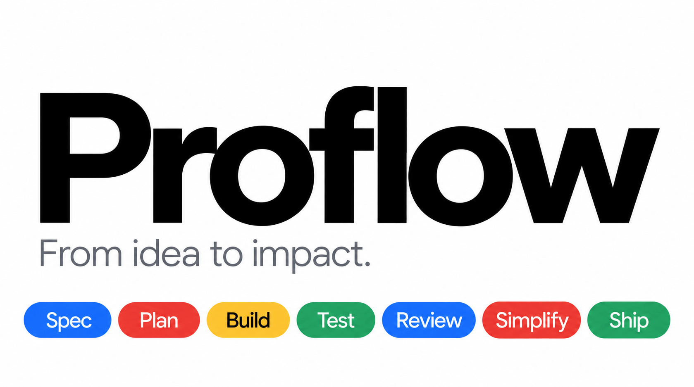

# proflow

**The engineering lifecycle for [Command Code](https://commandcode.ai) — spec, plan, build, test, review, ship.**

proflow brings [agent-skills](https://github.com/addyosmani/agent-skills) to Command Code: 26 production-grade skills and ten commands that make your agent work the way senior engineers do — specs before code, tests as proof, review before merge.

[](https://www.npmjs.com/package/@nntoan/proflow)
[](https://github.com/nntoan/proflow/actions/workflows/ci.yml)
[](LICENSE)



```
  DEFINE        PLAN        BUILD        VERIFY       REVIEW        SHIP
┌────────┐   ┌────────┐   ┌────────┐   ┌────────┐   ┌────────┐   ┌────────┐
│  SPEC  │──▶│ TASKS  │──▶│  CODE  │──▶│ PROOF  │──▶│  GATE  │──▶│  LIVE  │
└────────┘   └────────┘   └────────┘   └────────┘   └────────┘   └────────┘
  /spec       /to-plan      /build       /test      /to-review     /ship
```

Each command activates the skill that enforces the process, and stops where it should. `/spec` ends at an approved spec. `/build` makes one verifiable commit per task. `/ship` fans out to three reviewer personas and returns a GO/NO-GO with a rollback plan.

---

## Quick start

```bash
npx @nntoan/proflow install
```

Then restart Command Code (or run `/reload`). The installer resolves the project scope from the git root and writes only into `.commandcode/` — nothing global unless you ask for it.

Flags, scopes, the interactive wizard, and the optional packs: **[docs/install.md](docs/install.md)**.

---

## Commands

| What you're doing | Command | Principle |
|-------------------|---------|-----------|
| Sharpening a vague idea | `/brainstorm` | Explore before you commit |
| Defining what to build | `/spec` | Spec before code |
| Planning how to build it | `/to-plan` | Small, verifiable tasks |
| Building it | `/build` | One slice at a time (`/build auto` runs the whole plan) |
| Proving it works | `/test` | Tests are proof, not vibes |
| Reviewing before merge | `/to-review` | Five-axis review, `file:line` findings |
| Setting the quality bar | `/constraints` | Decide once, enforce everywhere |
| Simplifying | `/code-simplify` | Clarity over cleverness |
| Auditing web performance | `/webperf` | Measure before you optimize |
| Shipping | `/ship` | Three reviewers, GO/NO-GO, rollback plan |

> Command Code already owns `/plan` and `/review`, so proflow ships `/to-plan` and `/to-review`.

Specs, the reflection loop, and how each command maps to a skill: **[docs/commands.md](docs/commands.md)**.

---

## What you get

Installed natively into `.commandcode/` — no mod needed to load any of it:

**26 skills** · **10 commands** · **7 shared checklists** · **5 specialist personas**

Skills stay out of context until they are needed, each carrying its own verification gate and its own anti-rationalization table (the excuses agents use to skip steps, and the rebuttals). `/skill:<name>` invokes any of them directly.

### Optional packs

| Pack | Adds |
|------|------|
| `--magento2` | 36 namespaced `m2-*` skills, 18 commands, `m2-reviewer`/`m2-explorer`, and a docs-path guard hook |
| `--mod codegraph` | `codegraph_explore` / `node` / `status` — read-only, and they work in **plan mode** |
| `--mod gh` | all of `gh`: `gh_read` (no prompt) + `gh_run` (permission-gated) |
| `--mod orca` | all of `orca`: `orca_read` + `orca_run` |

---

## The proflow mod

Native files cannot block a dangerous command or render a footer, so a small mod does:

```
proflow · cache 99.90% • avg 99.86% · off-peak (−50%) • peak in 2h 14m · next: /to-plan
```

It appears only once proflow is in use, never names your provider, and shows the cache-hit rate, the peak/off-peak cost window, and the next lifecycle step. A three-tier guard sits on shell commands — `deny` (root-ish `rm -rf`, `dd of=/dev/sd*`, fork bombs, `curl | sh`, secret exfiltration), `confirm` (`git reset --hard`, `--no-verify`, `npm publish`, `DROP TABLE`, …) and `allow`, where your own regexes in `.commandcode/proflow.jsonc` win.

The full rule lists, the config schema, and the mod flags: **[docs/mod.md](docs/mod.md)**.

---

## License

MIT — © Toan Nguyen & proflow contributors. Vendored content keeps its own license alongside the package that carries it: [LICENSE.agent-skills](packages/proflow/LICENSE.agent-skills) for the Agent Skills content, [LICENSE.magento2](packages/magento2/LICENSE.magento2) for the Magento 2 pack.
