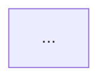

# Module Schema Guide

Use this file during Phase 3 to decide how to distribute feature functionality across Magento 2
modules. The goal is a schema where each module has a single, well-named responsibility and
dependencies flow in one direction only.

---

## Decision Matrix: New Module vs Modify Existing

**Create a new module when:**

- The feature introduces a new bounded domain concept (e.g. a new entity type, a new integration target)
- The code would couple an existing module to an unrelated concern
- The feature adds a surface (REST endpoint, admin grid, cron job) that the existing module does not have
- The change would cause the existing module's `composer.json` to gain unrelated dependencies

**Modify an existing module when:**

- The feature extends an entity already owned by that module (add columns, add service methods)
- The feature adds an observer or plugin to an event that logically belongs to the module's concern
- The change is small (≤ 5 files) and does not introduce new surfaces
- The existing module's README already describes this as a planned extension point

**Never modify a module when:**

- It is a Magento core module (`magento/module-*`)
- It is a third-party vendor module — use plugins or observers instead
- The modification would make the module name misleading

---

## Cohesion Rules

Each module must satisfy all three rules:

1. **Single concern** — the module name must fully describe its responsibility. If the name requires
   "and" (e.g. `OrderAndNotification`), split it.
2. **Dependency direction** — dependencies flow from high-level modules toward low-level ones.
   A data module (`Persistence`) must not depend on a UI module (`AdminUi`). If a cycle appears,
   extract a shared interface module.
3. **Surface match** — a module may include any surface combination from
   `module-create/references/surfaces.md`, but every surface it declares must
   serve its stated concern.

---

## Module Naming

Follow the same PascalCase convention as `m2-module-create`:

- `{Vendor}_{ConceptName}` — for standalone domain concepts
- `{Vendor}_{ExistingModule}Api` — for a new API-only module that extends an existing one
- `{Vendor}_{Integration}Connector` — for third-party integration modules
- Never: `{Vendor}_Utilities`, `{Vendor}_Common`, `{Vendor}_Base` — these indicate a design smell

---

## Dependency Direction Rules

```
[ThirdPartyConnector] → [DomainService] → [CoreEntity/Persistence]
       ↓                      ↓
   [RestApi]             [AdminUi]
       ↓
  [Frontend]
```

- Connector modules depend on service modules; service modules depend on persistence modules.
- UI modules (AdminUi, Frontend, RestApi) depend on service or persistence modules, never on each other.
- A persistence module must not depend on a UI module.
- If two modules need to share types, extract the shared types into a third module with only `core`
  and `service_contracts` surfaces (`{Name}Api` pattern).

---

## Module Schema Diagram

Produce a Mermaid diagram for every feature with more than one module. Use this template:

```
graph TD
    A[{Vendor}_ModuleA<br/>surfaces: core, persistence, service_contracts] -->|uses repository| B[{Vendor}_ModuleB<br/>surfaces: core, rest_api]
    A --> C[{Vendor}_ModuleC<br/>surfaces: core, admin_ui]
    D[Magento_Checkout] -->|event: checkout_submit_all_after| A
```

Rules for the diagram:

- Each node label: `{Vendor}_{Name}<br/>surfaces: {comma-separated}`
- Edge labels: the specific coupling (event name, interface used, config path read)
- Magento core modules shown as plain nodes with no surface list
- Existing modules being modified shown with `[{Vendor}_Name*]` (asterisk = modified)

---

## Output Format for Phase 3

Produce a module schema document with these sections:

### New Modules

| Module             | Surfaces                             | Reason for new module |
|--------------------|--------------------------------------|-----------------------|
| `{Vendor}_XyzCore` | core, persistence, service_contracts | New entity domain     |

### Modified Modules

| Module               | Changes                          | Reason                   |
|----------------------|----------------------------------|--------------------------|
| `{Vendor}_Existing*` | Add observer, new service method | Extends existing concern |

### Mermaid Diagram



### Dependency Load Order

List modules in the order they must be deployed (no module before its dependency):

1. `{Vendor}_XyzCore`
2. `{Vendor}_XyzAdmin`
3. `{Vendor}_XyzApi`

---

## Splitting a Large Feature

When the feature spans more than 5 modules or 3 distinct Magento areas, present the schema and
explicitly ask the user:

- Whether they want all modules created in one run or in stages
- Which modules are minimum viable (must ship together) vs optional
- Whether any modules already exist (even partially) in the codebase

These questions require explicit written answers from the user before continuing. Wait for the
user's reply, then incorporate the answers into the module schema before proceeding to Phase 4.
This is a blocking pause distinct from the Phase 4 approval gate — it may occur mid-Phase 3.
