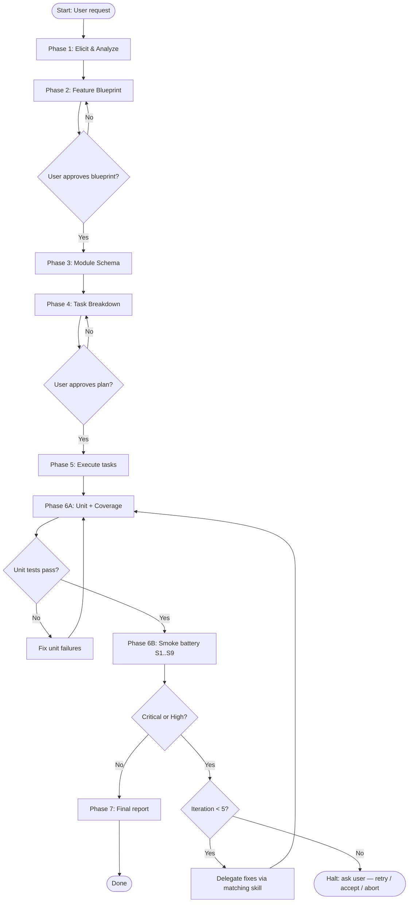

# Task Breakdown Guide

Use this file during Phase 4 to decompose a feature into ordered tasks, assign dependencies,
and produce diagrams the user can review before approving implementation.

---

## Task ID Format

Tasks use a two-part ID: `{TypePrefix}{Number}`

| Prefix | Type                                                                                   |
|--------|---------------------------------------------------------------------------------------|
| `M`    | Create new module (maps 1:1 to a `m2-module-create` invocation)                 |
| `X`    | Modify existing module (before an `X` task, the orchestrator may dispatch `explorer` to map the target module's execution paths and extension points first) |
| `E`    | EAV attribute (maps 1:1 to a `m2-eav-attribute` invocation)                     |
| `G`    | GraphQL surface design (maps 1:1 to a `m2-graphql` invocation)           |
| `F`    | Frontend asset (maps 1:1 to a `m2-frontend` invocation, when present)    |
| `I`    | Wire an extension point onto existing code (maps 1:1 to a `m2-extension-point` invocation — plugin/observer/preference) |
| `C`    | Add admin store configuration (maps 1:1 to a `m2-system-config` invocation)     |
| `L`    | Add a CLI command or cron job (maps 1:1 to a `m2-cli-command` invocation)       |
| `Q`    | Add an async message-queue surface (maps 1:1 to a `m2-message-queue` invocation) |
| `T`    | Write or expand tests (delegates to `m2-test-generate` when present)            |
| `R`    | Review (maps 1:1 to a `m2-review` invocation, `--diff` mode)             |
| `V`    | Validate (quality gate; may delegate to `m2-lint` when present)      |
| `D`    | Deploy (maps 1:1 to a `m2-deploy` invocation)                                   |
| `S`    | Smoke suite (Phase 6B — emitted by the skill, not user-authored)                       |
| `P`    | Report (final implementation report)                                                  |

Example task IDs: `M1`, `M2`, `X1`, `E1`, `G1`, `I1`, `C1`, `L1`, `Q1`, `T1`, `R1`, `V1`, `D1`, `S1`, `S2`, `S8`, `P1`.

**Type by work, not by tool availability.** The `1:1` mappings above name each task's *default
delegate*, not a precondition for using the type. A task is typed by the work it does — admin
config is always `C`, an extension point always `I`, and so on — even when the matching
delegated skill is absent and the work is generated inline (SKILL.md Phase 5 **Fallback
discipline**). Never downgrade a `C`/`I`/`L`/`Q`/`E`/`G` task to `X` just because its generator did
not run — that loses the type-based routing the prefix exists to provide.

### `S*` smoke tasks

Smoke tasks are emitted automatically when Phase 6B starts, not by the planner during Phase 4.
They are still recorded in `plan.md`'s `## Current State` checklist (so resume can pick them
up mid-loop) and in either `tasks.md` or `tasks/` so each suite's scope is documented. IDs are
the fixed suite numbers from `references/smoke-test-guide.md` (`S1` baseline & probe, `S2` REST,
`S3` admin login, `S4` Stores Config, `S5` admin grids, `S6` new/changed routes, `S7` customer
flows, `S8` exception.log diff, `S9` triage). Suites that do not apply to the feature are
omitted, not left unchecked.

---

## Task Record Format

Each task must contain:

```
### {ID}: {Short Title}

Type: Create Module | Modify Module | Test | Review | Validate | Deploy | Report
Target: {module name or file path}
Depends on: {comma-separated IDs, or "none"}
Skill: {skill invoked, or "manual"}
Model tier (advisory): {opus | sonnet | haiku}
Estimate: {S = <30 min | M = 30–90 min | L = >90 min}

Description:
{One to three sentences. What is done, not how.}

Included changes:
- {File path} — {what changes and why}
- {File path} — {what changes and why}

Risks:
- {Potential risk and mitigation, or "None identified"}

Acceptance criteria:
- {Specific, verifiable outcome}
- {Another criterion}
```

Estimate is informational only. Do not block execution on estimates.

---

## Model tier (advisory)

Each task record carries a `Model tier (advisory)` field — the model tier the task would ideally
run on. It is **advisory only**: the harness cannot pin a Skill-tool sub-skill invocation to a
specific model today, so these tasks run on the session model regardless (see SKILL.md
§"Model tiering (advisory)"). The field guides manual `/model` switching and future per-skill
pinning. The one place a tier takes live effect is the read-only `explorer` subagent
(its `haiku` frontmatter default + the `Explorer model` directive).

Default tier by task type:

| Tier | Task types | Why |
|------|-----------|-----|
| `opus` | `X`, `R`, `S9` triage | edits to unfamiliar code, review judgment, and security/perf triage — a weaker model here misses findings or mis-wires DI |
| `sonnet` | `M`, `T`, `I`, `G`, `F`, `S2`/`S4`/`S6`/`S7`, `P` | scaffolding, tests, extension points, scenario-bearing smoke, and report synthesis — correctness matters but the shape is known |
| `haiku` | `C`, `L`, `Q`, `E`, `V`, `D`, `S1`/`S3`/`S5`/`S8` | mechanical admin config, tool-running, and script-driven smoke |

The planner may raise a specific task above its default, recording a one-line reason on the task's
`Model tier (advisory)` line: a `G` surface with batch loaders / auth / schema migration → `opus`;
an architecturally novel `M` module → `opus`. Never downgrade `R` reviews or `S9` triage below
`opus`.

---

## Task Structure: Single File vs Folder

Task records are written **before the Phase 4 approval gate** (Phase 4 step 6), alongside
`plan.md`, so the user can review the full task detail before approving. They are still kept
**out** of `plan.md` itself — the plan stays an index; the detail lives only in the files below.
On a change-request, revise both `plan.md` and the affected records and keep them in sync.

**≤ 5 tasks** — save all task records to a single flat file: `.docs/{FeatureName}/tasks.md`.

**> 5 tasks** — save each task to its own file inside `.docs/{FeatureName}/tasks/`, named
`{NNN}-{ID}-{kebab-title}.md` (e.g. `001-M1-create-xyz-core.md`, `002-R1-review-xyz-core.md`).
The folder allows individual tasks to be read and updated in isolation during long-running
implementations, and the `{NNN}` prefix sorts them into execution order.

`{NNN}` is the **zero-padded execution-order index** (`001`, `002`, `003`, …) taken from the
dependency order: the first wave of tasks (no unmet dependencies) is `001`, the next wave `002`,
and so on. Tasks expected to run **in parallel** (same wave — marked `Parallel: yes`, with no
dependency between them) share the **same** `{NNN}`. Two tasks with index `003` are a parallel
group; index `004` only starts after every `003` task completes. The index encodes the same
ordering as the dependency graph in `plan.md` — keep them in sync.

```
tasks/
├── 001-M1-create-xyz-core.md
├── 002-R1-review-xyz-core.md
├── 003-X1-extend-checkout.md     # 003-X1 and 003-X2 run in parallel
├── 003-X2-extend-customer.md
├── 004-T1-test-xyz-core.md
└── ...
```

---

## Execution Plan Format (plan.md)

Save the execution plan to `.docs/{FeatureName}/plan.md` **for review before the approval gate**
(Phase 4 step 6), with `Status: Awaiting Approval`; flip it to `Status: Approved` once the user
approves. This file is the single source of truth for resuming interrupted runs. Its path is
anchored at the project root (`{ctx.docs_root}`), never under `{ctx.magento_root}`.

Required structure:

```markdown
# {Feature Name} — Execution Plan

Date: {YYYY-MM-DD}
Status: Awaiting Approval | Approved | In Progress | Complete
Blueprint: .docs/{FeatureName}/blueprint.md

---

## Implementation Flow

{Mermaid flowchart TD diagram — phases and approval gates}

---

## Module Schema

{Mermaid graph TD diagram — modules and their relationships from Phase 3}

---

## Task Dependency Graph

{Mermaid graph LR diagram — task-level dependency graph}

---

## Current State

- [ ] {ID}: {Short Title}
- [ ] {ID}: {Short Title}
- [ ] ...

(Mark each task [x] immediately after it completes. This section drives resume logic.)

---

## Smoke Iterations

Count: 0 / 5
Last run: —
Outcome: —

(The skill maintains this block during Phase 6B. Increment Count BEFORE each Phase 6 entry.
At Count == 5 with unresolved Critical/High, halt and prompt the user per
`smoke-test-guide.md` §Halt Prompt.)
```

Update the `Status:` line to `In Progress` at the start of Phase 5 and to `Complete` at the end
of Phase 7. Mark each task `[x]` and save `plan.md` after every completed task.

---

## Execution Ordering Rules

1. Module creation tasks (`M*`) for a dependency must complete before the module that depends on it.
2. Review tasks (`R*`) must immediately follow their corresponding creation or modification task.
3. Test tasks (`T*`) may run in parallel with other creation tasks when they are for different modules.
4. A single validate task (`V1`) runs after all module and test tasks are complete.
5. Deploy (`D1`) runs after `V1`.
6. Smoke suites (`S1`–`S9`) run as Phase 6B, after D1 and Phase 6A unit tests pass. Within
   Phase 6B the order is strict: **S1 → S2 → S3 → S4 → S5 → S6 → S7 → S8 → S9**. S1 and S8
   are always present; S2–S7 are emitted only when applicable.
7. Report (`P1`) is always last and only runs once S9 records 0 Critical / 0 High findings (or
   the user has chosen `accept-known-issues` at the iteration cap).

Default ordering template:

```
M1 → R1 → M2 → R2 → X1 → R3 → T* → V1 → D1 → (6A unit) → S1 → S2..S7 → S8 → S9 → P1
                                                              ↑               │
                                                              └─ fix loop ────┘  (max 5 iterations)
```

---

## Mermaid Dependency Graph

Produce a dependency graph showing which tasks block others. Use `graph LR` (left to right).

```mermaid
graph LR
    M1[M1: Create {Vendor}_XyzCore] --> R1[R1: Review {Vendor}_XyzCore]
    M2[M2: Create {Vendor}_XyzAdmin] --> R2[R2: Review {Vendor}_XyzAdmin]
    R1 --> M2
    R1 --> T1[T1: Unit tests XyzCore]
    R2 --> T2[T2: Unit tests XyzAdmin]
    T1 --> V1[V1: Validate all]
    T2 --> V1
    V1 --> D1[D1: Deploy]
    D1 --> S1[S1: Baseline & probe]
    S1 --> S2[S2: REST scenarios]
    S2 --> S3[S3: Admin login]
    S3 --> S4[S4: Stores Config]
    S4 --> S5[S5: Admin grids]
    S5 --> S6[S6: New routes]
    S6 --> S7[S7: Customer flows]
    S7 --> S8[S8: exception.log diff]
    S8 --> S9{S9: Critical/High?}
    S9 -- No --> P1[P1: Final report]
    S9 -- Yes / iter<5 --> FIX[Fix via delegated skill]
    FIX --> D1
    S9 -- Yes / iter==5 --> HALT([Halt: ask user])
```

Rules:

- Every task appears as a node with both ID and short title in the label.
- Arrows show blocking direction (A → B means B cannot start until A is done).
- Parallel tasks have no arrow between them.
- Do not include the legend — the ID prefixes are self-explanatory.

---

## Mermaid Flow Diagram

Produce a sequential flow diagram for the human reader. Use `flowchart TD` (top to bottom).
This shows phases, not individual tasks.



Include this flow diagram verbatim in the task breakdown output; it provides high-level orientation.

---

## Parallel Execution

Tasks with no dependency between them may be executed in parallel using sub-agents. Apply these rules:

- Only parallelize when the user has explicitly authorized parallel execution, or when there are
  ≥ 3 independent creation tasks and the user has not said "sequential".
- Never parallelize a review task with the creation task it reviews.
- Never parallelize two tasks that write to the same module.
- When parallelizing, note in the task record: `Parallel: yes` and list which tasks run together.

---

## Approval Gate

After producing the task breakdown, present this message verbatim before proceeding:

> **Plan ready for approval.**
> Tasks: {count} | Modules to create: {count} | Modules to modify: {count}
> Estimated total effort: {sum of estimates}
>
> Reply **"proceed"** to begin implementation, or describe any changes to the plan.

Do not write any code or invoke any sub-skill until the user replies with an explicit approval signal
("proceed", "yes", "go", "approved", "ok", or equivalent affirmative).
